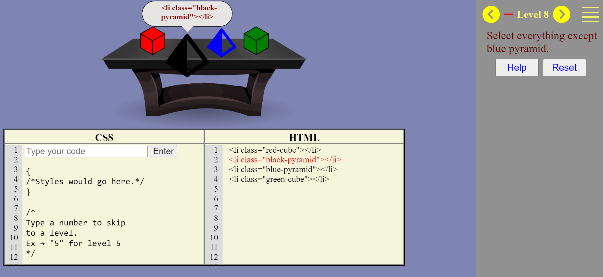

# CSS-Selectors

In this task, I have created a trainer for learning CSS selectors.
The trainer consists of multiple game levels.
Each level includes a layout example and HTML code that corresponds to the current level.
Some elements of the layout are highlighted using animation.
The user's task is to write a CSS selector that targets all the highlighted elements in the layout.

## Technology Stack:

- HTML
- SCSS
- TypeScript
- Webpack
- ESLint

## Deployment

You can see the deployment of the project at [https://slavr7.github.io/RSS-CSS-Selectors/](https://slavr7.github.io/RSS-CSS-Selectors/)

## Installation and Usage

To run this project locally, follow these steps:

1. Clone this repository.
2. Run 'npm install'.
3. Run 'npm start'.

## Screenshot

## Available Scripts

- **'npm run test':** This script runs the Jest testing framework, which is used for testing your code.
- **'npm run build':** This script triggers the Webpack bundler to build your project in production mode. It sets the Node environment to production.
- **'npm run build:dev':** This script instructs Webpack to build your project in development mode, optimizing it for development and debugging.
- **'npm run watch':** This script runs Webpack in watch mode, which continuously monitors your project files for changes and rebuilds it automatically when changes are detected.
- **'npm start':** This script starts a development server using Webpack's built-in development server, allowing you to preview and test your project locally.
- **'npm run lint':** This script runs ESLint, a code analysis tool, on the code located in the src directory of your project. It automatically fixes code style and syntax issues using the --fix option, ensuring that your code conforms to defined coding standards and maintains consistency.

